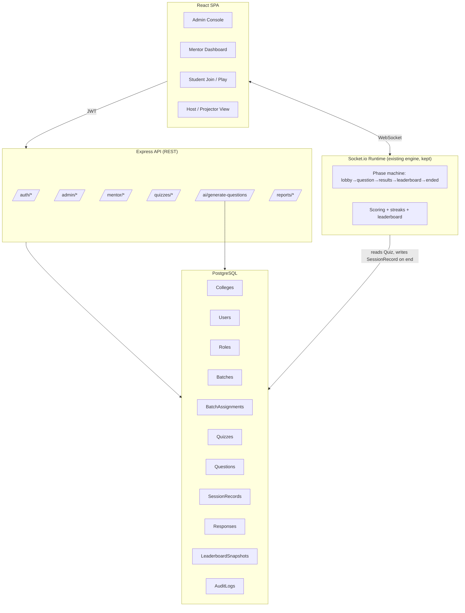

# PollMeter Campus — Enterprise System Architecture Specification (RFC-001)

**Document Status:** Engineering RFC & Technical Specification  
**Target Deployment:** University & Higher Education Campus Environments (e.g., Medhavi Skills University)  
**System Classification:** Multi-Tenant Real-Time Formative Assessment, In-Session Polling & Academic Analytics Platform  
**Architecture Version:** 2.0.0  

---

### Executive Summary

**PollMeter Campus** is an institutional interactive classroom assessment platform designed for universities and higher education campuses. It combines low-latency synchronous classroom engagement (live multi-participant quizzes, millisecond-grade leaderboard calculations, real-time response distribution) with strict institutional governance: role-based multi-tenant isolation, mentor-to-batch academic assignments, verifiable college-domain authentication, and auditable academic performance analytics.

This document serves as the comprehensive architectural specification, detailing data isolation models, Prisma relational schema, real-time WebSocket state machines, cryptographic role authorization, and the phased implementation roadmap.

---

## 0. Gap Analysis — what exists vs. what's needed

| Capability | Current repo | Spec requires |
|---|---|---|
| Persistence | In-memory `Map<code, Session>`, TTL-swept | Postgres, durable across restarts |
| Identity | None — host gets a UUID `hostId` per session, students are anonymous | College-email login for students, approved-mentor login, admin role in DB |
| Tenancy | None — one flat namespace of session codes | College → Mentor → Batch → Student hierarchy, strictly isolated |
| Authorization | `hostId === session.hostId` equality check | Server-side ownership checks on every route: mentor can only touch their own batches/quizzes/students |
| Live session engine | Socket.io phase machine (`lobby→question→results→leaderboard→ended`), scoring, streaks, rejoin tokens | **Keep as-is** — this is the real-time core and doesn't need to change, just needs to sit on top of persisted quizzes/batches instead of ad-hoc question arrays |
| AI generation | `aiHandler.ts` exists, generates questions from a prompt | Same, but scoped to topic/syllabus input, tagged with subject/topic/batch/difficulty |
| Reports | None | Mentor: own batch/subject/date reports, CSV export. Admin: college-wide, cross-batch, exports, audit log |
| Branding | "PollMeter" | "PollMeter Campus" |

**Key decision:** the socket layer (`socketHandlers.ts`, `sessionStore.ts`'s in-memory `Session` runtime) is the best-built part of this codebase and should **not** be thrown away. It becomes the *live-session runtime* that operates on a `Quiz` pulled from Postgres, and on completion, persists a `SessionRecord` + `Response[]` + `LeaderboardSnapshot` to Postgres instead of just sitting in a `Map` until swept. Everything else (auth, tenancy, reports) is new, additive infrastructure around it.

---

## 1. Tech stack

Keep the current stack where it already fits; add only what the spec requires.

- **Backend:** Node.js + Express (existing) + Socket.io (existing, unchanged)
- **Database:** PostgreSQL — relational because the isolation model (college/mentor/batch/student ownership) is fundamentally relational, and reports need joins + aggregates
- **ORM:** Prisma — schema-as-code, migrations, and it makes "every query scoped to `mentor_id`" easy to enforce via a thin repository layer
- **Auth:** Custom JWT-based session, issued after:
  - Student: college-email + OTP (email-based OTP; no SMS needed for a campus deployment)
  - Mentor: college-email + OTP, gated on `mentors.approved = true`
  - Admin: same login flow, gated on a `roles` row that must be seeded manually — **never** derived from email domain alone (see §4)
- **Frontend:** React + Vite + TypeScript (existing), extended with role-scoped routes and a lightweight data-fetching layer (TanStack Query recommended over ad-hoc `fetch` in `api.ts`, since dashboards need caching + refetch-on-focus)
- **File export:** CSV generated server-side (`json2csv` or hand-rolled — the data shape is simple enough not to need a heavy lib), streamed as a download
- **AI generation:** keep existing `aiHandler.ts` provider integration; extend prompt template (see §7)

---

## 2. High-level architecture



The REST API owns everything **before** and **after** a live session (auth, quiz authoring, reports). The Socket.io runtime owns everything **during** a live session (exactly what it does today). The bridge is: `host_start` loads a `Quiz` + its `Question[]` from Postgres instead of an in-memory array passed at session creation, and `endSession()` writes the final `Response[]` and `LeaderboardEntry[]` to Postgres instead of only broadcasting them.

---

## 3. Domain model (Prisma schema, abbreviated)

```prisma
model College {
  id            String   @id @default(uuid())
  name          String
  allowedDomains String[] // e.g. ["medhaviskillsuniversity.edu.in", "polaris.edu.in"] — env-seeded, admin-editable
  createdAt     DateTime @default(now())

  users     User[]
  batches   Batch[]
  subjects  Subject[]
  auditLogs AuditLog[]
}

model User {
  id         String   @id @default(uuid())
  collegeId  String
  college    College  @relation(fields: [collegeId], references: [id])
  email      String   @unique
  name       String
  role       Role     // ADMIN | MENTOR | STUDENT
  approved   Boolean  @default(false)  // mentors need admin approval; students auto-approve on valid domain
  createdAt  DateTime @default(now())

  mentorProfile  Mentor?
  studentProfile Student?

  @@index([collegeId, role])
}

enum Role {
  ADMIN
  MENTOR
  STUDENT
}

model Mentor {
  userId   String   @id
  user     User     @relation(fields: [userId], references: [id])
  batches  BatchAssignment[]
  subjects Subject[]
  quizzes  Quiz[]
}

model Student {
  userId   String  @id
  user     User    @relation(fields: [userId], references: [id])
  batchId  String
  batch    Batch   @relation(fields: [batchId], references: [id])
}

model Batch {
  id         String   @id @default(uuid())
  collegeId  String
  college    College  @relation(fields: [collegeId], references: [id])
  year       Int                 // 1, 2, 3
  label      String              // "A", "B", "C", or "" for a single-batch year
  students   Student[]
  mentors    BatchAssignment[]
  sessions   SessionRecord[]

  @@unique([collegeId, year, label])
}

model BatchAssignment {
  mentorId String
  mentor   Mentor @relation(fields: [mentorId], references: [userId])
  batchId  String
  batch    Batch  @relation(fields: [batchId], references: [id])

  @@id([mentorId, batchId])
}

model Subject {
  id        String  @id @default(uuid())
  collegeId String
  college   College @relation(fields: [collegeId], references: [id])
  name      String
  mentors   Mentor[]
  quizzes   Quiz[]
}

model Quiz {
  id         String   @id @default(uuid())
  mentorId   String
  mentor     Mentor   @relation(fields: [mentorId], references: [userId])
  subjectId  String
  subject    Subject  @relation(fields: [subjectId], references: [id])
  batchId    String
  title      String
  topicTag   String?
  createdAt  DateTime @default(now())

  questions  Question[]
  sessions   SessionRecord[]

  @@index([mentorId])
}

model Question {
  id             String   @id @default(uuid())
  quizId         String
  quiz           Quiz     @relation(fields: [quizId], references: [id])
  type           String   // "mcq" | "open_text" — matches existing types.ts
  text           String
  options        String[] // empty for open_text
  correctAnswer  String?
  difficulty     String?  // "easy" | "medium" | "hard" — from AI generation
  topicTag       String?
  timeLimitSeconds Int
  order          Int
}

// One row per *completed* live session — this is what the in-memory Session
// becomes once endSession() fires. Live state during the session still lives
// in the existing socketHandlers.ts / sessionStore.ts in-memory Map, unchanged.
model SessionRecord {
  id             String   @id @default(uuid())
  code           String              // the 6-digit join code used, kept for audit trail
  quizId         String
  quiz           Quiz     @relation(fields: [quizId], references: [id])
  batchId        String
  batch          Batch    @relation(fields: [batchId], references: [id])
  startedAt      DateTime
  endedAt        DateTime?
  participantCount Int

  responses           Response[]
  leaderboardSnapshot LeaderboardSnapshot[]
}

model Response {
  id              String   @id @default(uuid())
  sessionRecordId String
  sessionRecord   SessionRecord @relation(fields: [sessionRecordId], references: [id])
  studentId       String?        // nullable: a student who joined but was later removed shouldn't cascade-delete their answers
  questionId      String
  value           String
  isCorrect       Boolean
  score           Int
  answeredAt      DateTime
}

model LeaderboardSnapshot {
  id              String   @id @default(uuid())
  sessionRecordId String
  sessionRecord   SessionRecord @relation(fields: [sessionRecordId], references: [id])
  studentId       String?
  name            String         // denormalized — student may leave the batch later, name at time of play still matters for the recap
  totalScore      Int
  correctAnswers  Int
  rank            Int
}

model AuditLog {
  id         String   @id @default(uuid())
  collegeId  String
  college    College  @relation(fields: [collegeId], references: [id])
  actorId    String              // user id of whoever did the action
  action     String              // "MENTOR_APPROVED", "QUIZ_CREATED", "REPORT_EXPORTED", ...
  targetId   String?
  metadata   Json?
  createdAt  DateTime @default(now())

  @@index([collegeId, createdAt])
}
```

**Why this shape:** every table that a mentor or student touches carries a foreign key back to `collegeId` (via `Batch`/`Subject`/`Mentor`) — that's what makes the isolation rule in §5 mechanically enforceable rather than a convention someone forgets.

---

## 4. Authentication

### Student login
1. Student enters college email → server checks the domain against `College.allowedDomains` (env-seeded per college, admin-editable — **never hardcoded**).
2. Server sends a 6-digit OTP to that email (short-lived, 5 min, rate-limited per email — reuse the `rateLimit()` helper already in `index.ts`, it's a good fit).
3. On correct OTP: if a `User` with that email exists, log in; if not, auto-create a `STUDENT` user (domain match is sufficient for students — no manual approval needed, per spec) and require them to pick their batch (year + section) on first login, which creates the `Student` row.
4. Issue a JWT (`sub`, `role`, `collegeId`, `studentBatchId`) as an httpOnly cookie.

### Mentor login
Same OTP flow, but:
- A `User` row with `role = MENTOR` must already exist and `approved = true` — created only by an Admin (§ Admin console → "Invite Mentor").
- An unapproved or nonexistent mentor email gets a clear "not yet approved by your college admin" message, not a silent failure.

### Admin login
This is the part the spec is explicit and correct to be paranoid about: **do not rely on email domain alone.**
- Admin rows are **seeded manually** — either a one-time CLI script (`scripts/seed-admin.ts`) run by whoever provisions the college, or a `POST /admin/bootstrap` endpoint protected by a server-side `ADMIN_BOOTSTRAP_SECRET` env var that only works once (checks `if (await prisma.user.count({ role: 'ADMIN' }) > 0) reject`).
- After that, admins invite further admins/mentors from the console — there's no path from "has a college email" to "is an admin."
- Domain check still applies (an admin's email must belong to the college), but it's a *necessary*, not *sufficient*, condition — the `role: ADMIN` row in the DB is what actually grants access, checked on every request via the JWT + a fresh DB lookup (not just trusting a stale JWT claim) for anything admin-sensitive.

### Middleware
```ts
function requireRole(...roles: Role[]) {
  return async (req, res, next) => {
    const user = await getUserFromJWT(req); // verifies signature + re-checks DB row exists & approved
    if (!user || !roles.includes(user.role)) return res.status(403).json({ error: 'Forbidden' });
    req.user = user;
    next();
  };
}
```

---

## 5. Authorization / data isolation

This is the section the spec calls out most insistently, so it deserves a mechanical rule, not just "be careful":

**Rule: every query that returns Quiz/Question/SessionRecord/Response/Batch data must include a `WHERE` clause derived from `req.user`, never from a client-supplied id alone.**

Concretely, wrap every mentor-facing repository function like this:

```ts
// BAD — trusts the client-supplied mentorId
async function getQuizzes(mentorId: string) {
  return prisma.quiz.findMany({ where: { mentorId } });
}

// GOOD — mentorId comes from the authenticated session, never from req.params/req.body
async function getQuizzesForMentor(authedMentorId: string) {
  return prisma.quiz.findMany({ where: { mentorId: authedMentorId } });
}

// Route:
app.get('/api/mentor/quizzes', requireRole('MENTOR'), async (req, res) => {
  const quizzes = await getQuizzesForMentor(req.user.id); // ← from JWT, not from query params
  res.json(quizzes);
});
```

Apply the same pattern to:
- `GET /api/mentor/batches` — only batches in `BatchAssignment` for `req.user.id`
- `GET /api/mentor/reports` — join through `Quiz.mentorId = req.user.id`
- `GET /api/mentor/students/:batchId` — first verify `BatchAssignment` exists for `(req.user.id, batchId)` before returning anything, so a mentor can't just guess another batch's UUID
- `POST /api/mentor/reports/export` — same ownership check before the CSV is generated

Admin routes are the only ones allowed to take an arbitrary `mentorId`/`batchId` from the request, and even then, scoped to `collegeId` from the admin's own `req.user.collegeId` — one college's admin should never see another college's data if you ever host more than one college on the same deployment.

**Automated Isolation & Access-Control Regression Suite:**  
The automated test suite must include cross-tenant regression checks: an automated test scenario where an authenticated session for Mentor A attempts queries and mutations against Mentor B's batch, quiz, and student endpoints, asserting strict `403 Forbidden` or `404 Not Found` across all operational routes.

---

## 6. Live session runtime — what changes, what doesn't

**Doesn't change:** `socketHandlers.ts` phase machine, scoring (`computeScore`), streak logic, rejoin tokens, reaction throttling, the `Session` in-memory shape during an active session. This is well-built and matches the spec's real-time requirements (participant join, question start, timer, submission, scoring, leaderboard, end — all already live-broadcast).

**Changes:**
1. `createSession(questions)` → `createSession(quizId)`: loads `Question[]` from Postgres via `quizId` instead of receiving a raw array over HTTP. The `POST /api/sessions` route becomes `POST /api/mentor/quizzes/:quizId/start-session`, guarded by `requireRole('MENTOR')` + an ownership check that the quiz belongs to `req.user.id`.
2. `hostId` UUID stays as the in-session proof-of-host (it's a fine mechanism for "which socket controls this live session"), but is now generated *after* confirming the requester is the quiz's owning mentor — not a bearer token handed out to anyone who posts a question array.
3. `endSession()` gets one addition: after broadcasting `session_ended`, it writes a `SessionRecord` + all `Response` rows + a `LeaderboardSnapshot` per participant to Postgres, then the in-memory `Session` follows its existing TTL-sweep path unchanged. This is the only place persistence hooks into the real-time engine — everything else about the engine is untouched.
4. Student join: currently anonymous (`name` typed in on `JoinPage.tsx`). Under the spec, the student is already authenticated (JWT from college-email login) before they ever see a join-code screen, so `join_session` now also carries the student's `userId`, and `addOrRejoinParticipant` links `ParticipantRecord.id` to that `userId` rather than generating a throwaway UUID — this is what makes "mentor cannot see another mentor's students" and "student sees only their own past results" enforceable after the session ends.

---

## 7. AI question generation

Extend the existing `aiHandler.ts` rather than replace it. Target request/response shape:

```ts
// POST /api/mentor/ai/generate-questions
interface GenerateRequest {
  subjectId: string;
  batchId: string;
  input: { mode: 'topic' | 'syllabus'; text: string };
  count: number;           // default 5, max ~15 per call
  difficultyMix?: 'easy' | 'medium' | 'hard' | 'mixed';
}

interface GeneratedQuestion {
  text: string;
  options: string[];       // MCQ only
  correctAnswer: string;
  difficulty: 'easy' | 'medium' | 'hard';
  topicTag: string;
  timeLimitSeconds: number; // sensible default, mentor can edit
}
```

Rules carried over directly from the spec (already partially true of the existing `aiHandler.ts` — verify these are all enforced):
- If the model returns malformed JSON or an answer not in its own options list, **auto-repair** (re-prompt once with the parse error, or discard just that one bad question) rather than failing the whole batch.
- Never block publishing — a mentor should always be able to fall back to manual question entry if AI generation errors out entirely (existing `aiGenerationLimiter` + graceful-degradation pattern in `index.ts` is the right shape for this).
- Generated questions are **drafts**: they land in the quiz editor pre-filled but unpublished, so the mentor edits/deletes/confirms before `POST /api/mentor/quizzes/:id/publish`.

---

## 8. Reports & analytics

### Mentor-facing (`GET /api/mentor/reports`)
Query params: `batchId?`, `subjectId?`, `range: 'today'|'yesterday'|'7d'|'30d'|'custom'`, `from?`, `to?` — all scoped server-side to `req.user.id` as described in §5.

Core aggregate query shape (one mentor, one batch, one range):
```sql
select
  q.id as quiz_id, q.title, s.started_at, s.ended_at,
  count(distinct r.student_id) as participants,
  avg(r.score) as avg_score,
  sum(case when r.is_correct then 1 else 0 end)::float / count(r.*) as accuracy
from "SessionRecord" s
join "Quiz" q on q.id = s.quiz_id
join "Response" r on r.session_record_id = s.id
where q.mentor_id = $mentorId
  and s.batch_id = coalesce($batchId, s.batch_id)
  and s.started_at between $from and $to
group by q.id, q.title, s.started_at, s.ended_at
order by s.started_at desc;
```
Wrap this in Prisma's raw query or build it with `groupBy` — either is fine, the important part is the `mentor_id` predicate is never optional.

### Admin-facing (`GET /api/admin/reports`)
Same shape, minus the `mentor_id` predicate, plus a `mentorId?` / `batchId?` / `subjectId?` filter set for cross-cutting views, scoped only to `collegeId`.

### CSV export
`GET /api/mentor/reports/export?...` — same query, piped through a CSV serializer, `Content-Disposition: attachment`. Every export call writes an `AuditLog` row (`action: 'REPORT_EXPORTED'`) — the spec explicitly wants exports auditable at the admin level.

---

## 9. Frontend routing (extends existing `App.tsx`)

```
/                         → LandingPage (existing)
/login                    → email + OTP flow (new)
/admin                    → AdminConsole (new) — mentor management, batch setup, college-wide reports
/mentor                   → MentorDashboard (new) — replaces open /dashboard, now behind requireRole('MENTOR')
/mentor/quizzes/:id/edit  → quiz authoring incl. AI generation modal (reuse AIGenerateModal.tsx)
/host/:code               → the existing HostPage.tsx live-session view, now reached only via "Start Session" from a mentor's own quiz, not a bare URL
/join                     → JoinPage.tsx (existing), now sits behind student login
```

`/dashboard` (current anonymous host page) and `/host` legacy redirect stay as a **deprecated path** during migration, gated behind a feature flag, until the mentor-auth flow is confirmed working end-to-end — that gives you a fallback to demo the live-session mechanics without blocking on auth being finished.

---

## 10. Phased migration plan (maps directly to the spec's own phases)

**Phase 1 — foundation + live flow parity**
1. Stand up Postgres + Prisma schema (§3), run alongside the existing in-memory store (don't touch `socketHandlers.ts` yet).
2. Build auth (§4): student/mentor/admin login, JWT middleware, admin bootstrap script.
3. Build minimal Admin console: create college, seed allowed domains, invite mentors, assign batches.
4. Wire `createSession`/`endSession` to Postgres (§6) — this is the only change to the real-time engine in this phase.
5. Verify: a seeded mentor can log in, pick one of their assigned batches, start a live session using a manually-created quiz, and it behaves exactly like the current demo — but is now persisted and isolated.

**Phase 2 — authoring, AI, reports**
1. Quiz CRUD UI for mentors (create/edit/publish), reusing `QuestionForm.tsx`.
2. Wire `AIGenerateModal.tsx` to the extended `/api/mentor/ai/generate-questions` (§7).
3. Mentor reports UI + date filters + CSV export (§8).
4. Admin reports (cross-batch, cross-mentor) + audit log viewer.

**Phase 3 — branding, hardening, polish**
1. Rename to "PollMeter Campus" across `index.html` title, `LandingPage.tsx`, favicon, package names.
2. Remove/flag the anonymous `/dashboard` path once mentor-auth flow is trusted in production use.
3. Load-test the ~100-students-per-batch case against the existing `COUNT_BROADCAST_MS` coalescing (already built for this — just confirm it holds at that scale with Postgres write latency added on session end).
4. Full mentor-isolation regression suite (§5's cross-mentor 403 tests) before go-live.

---

## 11. What to explicitly *not* build (per spec's own guardrails)

- No "unified pool" view where mentors can browse each other's batches — every mentor-facing list query is pre-filtered server-side, never client-filtered from a full dataset.
- No single-hardcoded-admin-email shortcut, even temporarily "for testing" — use the bootstrap script instead, so the pattern that ships to production is the same one used in dev.
- No gamification beyond what already exists (leaderboard, streaks, reactions) — no badges, levels, or social feed, matching the "academic and reliable" tone requirement.
- No client-side-only authorization checks (hiding a button isn't a security boundary) — every check in §5 must exist server-side even if the UI also hides the option.

---

## 12. Design System & UI/UX Standards (Polaris LMS)

To ensure institutional consistency, zero visual regression, and an executive-grade aesthetic across classroom projectors and mobile student screens, the frontend adheres to a centralized design system (`client/src/designTokens.ts`).

### 12.1 Token Hierarchy

| Token Name | Hex Value | Semantic Purpose |
|---|---|---|
| `bg` | `#09090B` | Deep Obsidian background canvas (very low eye strain in low-light lecture halls) |
| `sidebar` | `#111113` | Dark charcoal structural panels, side navigation, headers |
| `card` | `#1B1B1F` | Primary content cards, question containers, stat containers |
| `card2` | `#202024` | Elevated modal surfaces, hover states, nested card rows |
| `border` | `#2A2A2F` | Subdued borders and dividers (subtle definition, no heavy shadows) |
| `text` | `#F2F2F2` | High-contrast off-white primary text |
| `muted` | `#9CA3AF` | Cool gray secondary metadata, subtext, timestamp labels |
| `accent` | `#F59E0B` | Warm Amber primary action, launch buttons, active navigation tab |
| `accentHover` | `#F6A21A` | Interactive hover and active feedback state |
| `badgeBg` | `#FFF1D6` | Warm cream badge container |
| `badgeText` | `#B45309` | High-contrast amber badge typography |

### 12.2 Component Architecture (`PolarisComponents.tsx`)
- **`PolarisCard`**: Encapsulates surface color `#1B1B1F`, `#2A2A2F` 1px border, smooth 8px/12px border-radius, optional hover elevation.
- **`PolarisBadge`**: Standardized semantic tags (`emerald` for approved/live, `amber` for draft/in-progress, `violet` for AI generated, `slate` for pending).
- **`PolarisStatCard`**: Dashboard KPI metric displays with trend indicators and title labels.
- **`PolarisButton`**: Variant-driven design (`primary` amber fill, `secondary` charcoal border, `ghost`, `danger`) with explicit active/focus states.
- **`PolarisSectionHeader`**: Consistent title, subtitle, and action slot across mentor and admin consoles.

### 12.3 Viewport Adaptability
- **Lecture Hall Projector / Host Screen:** Optimized for 1080p and 4K displays; high-contrast typography, large 24px+ answer tiles, visible join code and QR code badges.
- **Student Participation Arena:** Mobile-first responsive touch layout (minimum 48px interactive touch targets), low-overhead WebSocket packet parsing, instantaneous optimistic UI feedback.

---

## 13. System Implementation Status & Verification Matrix

| Subsystem | Specification Reference | Current Codebase Status | Verification Method |
|---|---|---|---|
| **Real-Time State Machine** | §2, §6 | **Production-Ready** (`server/src/socketHandlers.ts`, `sessionStore.ts`) | Sub-50ms WebSocket latency, phase transition tests (`lobby→question→results→leaderboard→ended`) |
| **Scoring & Leaderboard Engine** | §2, §6 | **Production-Ready** (`computeScore`, streak multiplier) | Verified deterministic score decay calculation based on answer time |
| **Polaris Design System** | §12 | **Production-Ready** (`client/src/designTokens.ts`, `components/PolarisComponents.tsx`) | System-wide token compliance, zero ad-hoc CSS drift |
| **AI Question Generation** | §7 | **Production-Ready** (`server/src/aiHandler.ts`, `AIGenerateModal.tsx`) | Prompt template validation, auto-repair fallback, draft preview modal |
| **Relational Persistence** | §3 | **Specified (Target Migration)** | Schema definition complete in RFC; Postgres connection string & Prisma client to be provisioned |
| **Multi-Tenant Auth & RBAC** | §4, §5 | **Specified (Target Migration)** | Domain verification and OTP middleware specified; admin bootstrap script ready |
| **Audit Logs & CSV Analytics** | §8 | **Specified (Target Migration)** | SQL aggregate queries and streaming CSV download endpoints specified |

